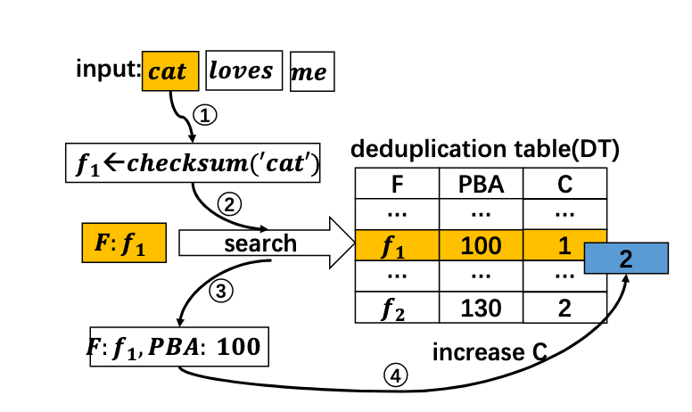

1 数据量的爆炸增长对现有存储系统的容量、吞吐性能、可扩展性、可靠性、安全性、 可维护性和能耗管理等各个方面都带来新的挑战， 消除冗余信息优化存储空间效率成为 缓解存储容量瓶颈的重要手段，现有消除信息冗余的主要技术包括数据压缩和数据去 重。

2 数据压缩是通过编码方法用更少的位（ bit）表达原始数据的过程，根据编码 过程是否损失原始信息量，又可将数据压缩细分为无损压缩和有损压缩。无损压缩通常 利用统计冗余，用较少的位表达具有更高出现频率的位串，根据编码算法和字典信息可 从无损压缩数据中完全恢复出原始数据信息。

3 数据去重

数据去重（ Data Deduplication）是在数据集或数据流中发现和消除重复内容以提高 数据的存储和/或传输效率的过程，又称重复数据删除（ Duplicate Data Elimination），简 称去重或重删。作为优化存储空间的一项关键技术，数据去重有助于减少存储系统的资 源开销和总体拥有成本（ Total Cost of Ownership, TCO），其优点包括：

增加单位存储空间所能容纳的数据量以提高存储空间效率。

减少维护单位数据量所需的设备资源和降低相应能耗。

通过避免发送重复内容提高网络传输效率。

4 数据备份。

数据备份通过创建和 转储目标数据集在不同时间点的多个副本来提高数据的可靠性。数据备份根据策略不同 一般可分为全量备份（ Full Backup）、差异增量备份（ Differential Incremental Backup） 和累积增量备份（ Cumulative Incremental Backup）。全量备份每次复制并保存目标数据 集的完整副本，因此需要最长的备份时间和最多的存储空间；差异增量备份仅复制和保 存上一次全量或差异增量备份之后修改过的数据，该策略减少了数据传输量，但恢复数 据时需要首先还原到上一次全量备份，然后依次还原所有后续的差异增量数据，具有较 差的恢复时间目标（ Recovery Time Objectives, RTO）；累积增量备份复制和保存上一次 全量备份之后修改过的所有数据， 因此恢复数据时仅需要还原上一次全量备份和最近的。

5 重复数据的界定方法

新型存储解决方案引入基于内容的重复数据界定方法，此 类方法可工作在字节、块或文件等三种不同的粒度级别。

字节级重复数据界定方法主要采用 Delta 编码算法。该算法将文件看成一系列符 号组成的有序串，通过计算并编码待处理文件 _F__new_ 与既有基准文件 _F__base_ 之间的差量数 据形成 _delta_(_F__new_, _F__base_)文件。若 _F__new_ 与 _F__base_ 之间具有很高的相似度，则仅存储 _delta_(_F__new_,_F__base_)能够达到节约存储空间的效果。

文件级重复数据界定方法通常采用高可靠性哈希算法（如 MD5 和 SHA-1）为给定 文件生成具有极低冲突概率的标识符（也称指纹），并通过筛查相同标识符来识别重复 文件文件是管理非结构化数据所普遍使用的数据组织单元，常见文件如文档、图 片、音频和视频等都具有特定的数据结构且容易作为整体在不同的存储区域（如文件夹）

块级重复数据界定方法主要用于在相似而不相同的文件之间检测重复数据， 其通常 采用基于哈希的内容标识技术， 以达到比字节级去重更高的重复数据筛查速度和更广的 重复内容检测范围。确定分块边界的主要方法可分为两类，包括：固定长度分块和可变 长度分块。

固定长度分块方法通常将目标文件划分为具有相同尺寸 _L__fixed_ 的分块（ block）， 然后去重过程计算每个分块的指纹，并从中筛查出重复的数据对象。该方法简单高效， 但当文件因插入数据而形成新版本时， 原有分块的边界可能漂移到无法用既定算法捕获 的位置，从而导致重复数据无法被检测。

基于滑动窗口的固定长度分块方法[30]采用长度为 _W_=_L__fixed_ 的窗口分析文件数据。该 方法首先计算窗口内数据的哈希值， 然后查询系统中是否已存在重复哈希记录。若存在， 则确定当前窗口内的数据为重复分块，并直接将窗口滑动到未处理的数据区；反之，则 将窗口向前滑动一个字节，重新计算窗口内数据的哈希值并查询其重复性。若窗口向前 滑动 _L__fixed_ 字节仍未捕捉到重复分块，则划分之前的数据为一个长度为 _L__fixed_ 的非重复分。此类方法能够解决因插入数据导致的边界 漂移问题，但其需要频繁计算候选分块指纹和查询指纹重复性，具有很高的时间开销， 因此缺乏实用性。

基于内容的分块（ Content Defined Chunking, CDC）算法是最常用的可变长度分块 方法[31-33]，其通常利用长度 _w_<<_L__fixed_ 的滑动窗口分析文件数据，并采用具有较低计算复 杂度的哈希算法快速计算窗口内数据的指纹，若发现某个指纹匹配预定义的模式，则选 择该滑动窗口所在位置为一个块边界。如图 1.6 所示，由于滑动窗口中数据的指纹仅依 赖于其内容和既定的哈希函数，文件a中数据块 _e_ 的边界能够在文件b中重新捕获，进 而后续的重复数据也都能够被再次发现。此类方法通常选用 Rabin 指纹算法[34]计算窗口 内数据的指纹，其计算效率远高于用于生成块指纹的高可靠性哈希算法（如 MD5 和SHA-1），具有很强的实用性且被广泛应用到各种去重解决方案中。

6 去重效率的评估方法

在基于网络的分布式存储环境中，数据去重可以选择性部署在源端（客户端）或宿 端（服务端）。源端去重（ Source Deduplication） [36,37]首先在客户端计算待传输数据的 指纹并通过与服务端进行指纹比对发现和消除重复内容， 然后仅向服务端发送非重复数 据内容，从而达到同时节约网络带宽和存储资源的目标。宿端去重（ DestinationDeduplication） [11]直接将客户端的数据传输到服务端，并在服务端内部检测和消除重复 内容。两种部署方式都能够提高存储空间效率，其主要区别在于源端去重通过消耗客户。

数据去重的效率可从时间和空间两个维度进行评估。从时效性方面，可将数据去重 方 法 划 分 为 在 线 去 重 （Inline Deduplication ） [38] 和 后 处 理 去 重 （Postprocessing Deduplication） [39]。在线去重在数据写入存储系统之前完成重复内容的界定、检测和删 除过程。为了保障实时性，在线去重通常在内存中维护全部的数据索引（如哈希表）， 且需要消耗大量的计算资源。后处理去重将数据写入存储系统之后再适时检测和消除重 复内容，其对计算和内存资源占用率较低，但具有较大的硬盘空间开销且无法保障去重过程的完成时间。

去重时间效率（去重性能）的量化评价指标为吞吐率（ Throughput）。宿端去重的 吞吐率通常以网卡吞吐能力为上限。

7  当前去重方法突破性能瓶颈的主要技术手段包括构造内存快速索引、 挖掘数据局部 性、利用数据相似性和使用新型存储介质等。

8  Data Domain 去重 文件系统（ Data Domain Deduplication File System, DDDFS）的技术架构。 DDDFS 分为 访问接口、文件服务、内容管理、段管理和容器管理五个层次，其中访问接口层对外提 供 NFS、 CIFS 和 VTL 等标准协议的访问服务；文件服务层负责名字空间及文件元数据 管理；内容管理层将文件分割为可变长的数据段（块），并计算段指纹和创建文件的段 构造表；段管理层维护数据段的索引信息并侦测和消除其中的重复数据；内容管理层将 平均长度为 8KB 的段聚合并封装在 4MB 大小的容器中， 并采用顺序压缩算法进一步提高数据的存储空间效率， 此外， 采用容器作为存储单元还有利于提高数据的读写吞吐率。

9 提高去重效率的方法

Mark Lillibridge 等[17]于 2009 年提出 Sparse Indexing 方法同时挖掘数据的局部性和 相似性以进一步减少内存开销。 Sparse Indexing 采用双限双模算法（ Two-Thresholds  
Two-Divisors, TTTD） [41]将备份数据流切割成平均长度为 4KB 的分块，并按基于内容 的分块算法的基本原则将分块序列划分为 10MB 量级的数据段。在存储端， Sparse  
Indexing 以 1/2_n_ 的采样率从每段数据中抽取分块指纹并以此创建内存索引，其中被采样 的块指纹称为钩子（ hook），每个钩子维护至多 _L_ 个与之关联的段标识符。每个新数据 段 _S_ 首先会被取样，然后通过查询内存索引确定与该数据段共享钩子数量最多的 _M_ 个 相似数据段。最后， Sparse Indexing 加载 _M_ 个相似数据段的全部指纹信息与新数据段 _S_ 的指纹序列进行比对并消除后者所含重复分块。由上可知， Sparse Indexing 是一种近似的去重解决方案，它允许少量重复内容存在于相似度较低的数据段之间，从而达到减少内存开销和提高去重性能的目标。

为了避免查找重复内容时的硬盘访问瓶颈和进一步提高去重性能， Biplob Debnath 等[21]在 ChunkStash 解决方案中采用固态盘存储全部指纹索引。 ChunkStash 将数据流划 分成平均长度为 8KB 的分块序列，每个分块采用 64 字节记录指纹和元数据信息，每1024 个块被封装为一个保持局部性的容器（ Container），其相应的 64KB 指纹信息被保 存在固态盘的一个逻辑页面中，固态盘具有 100~1000 倍于磁盘的访问效率，因此能够 从根本上提升指纹的查找性能。 ChunkStash 在内存中维护三种数据结构，包括元数据缓 存、写缓存和紧凑型哈希表（ Compact Hash Table）。其中元数据缓存维护从固态盘预取 的各容器的指纹序列，用于挖掘数据局部性；写缓存用于缓冲去重后的数据及其指纹， 以便封装为容器和提高固态盘索引的写入效率； 紧凑型哈希表用于存储固态盘索引的摘 要信息，每个表项包含 2 字节的紧凑指纹摘要和 4 字节的固态盘地址，以便去重过程能 够直接从固态盘中读取该表项对应容器的完整指纹信息。对于新收到的数据块，ChunkStash 首先在元数据缓存和写缓存中查找可能的重复指纹， 若未找到则进一步查询 紧凑型哈希表， 并在哈希命中时读取固态盘上对应容器的指纹页面确认该数据块的重复 性。由于紧凑型哈希表仅记录 2字节的指纹摘要，当查询某个目标发生哈希冲突时则会 导致对固态盘的错误读取。 根据上述数据可知， 若采用 8KB 的平均分块长度， 则 256GB固态盘可存储约 32TB 数据的全部块指纹，而对应的内存开销约为 24GB。为了进一步 节约内存开销， Biplob Debnath 等提出采用类似于 Sparse Indexing 的采样方法，仅在每 个容器中抽取部分指纹插入紧凑型哈希表，并允许 ChunkStash 成为一种近似去重方法。 其实验显示，当采用 1.563%的采样率时，仅有约 0.5%的重复分块无法识别。

Wen Xia 等[42]提出 SiLo 去重解决方案，综合挖掘数据的局部性和相似性以 提高去重性能和减少内存开销。 SiLo 在变长块（ Chunk）和文件的基础上引入段 （ Segment）和区（ Block）的概念，其中变长块是长度在 8KB 量级的重复数据删除单 元；段是长度在 2MB 量级的相似性评估单元，大文件的数据可能分布到多个段中，而 多个小文件的内容也可能被聚合为一个段；区由多个段构成，是长度在 256MB 量级的 局部性保持单元。SiLo 在内存中维护三种数据结构：相似性哈希表 （ Similarity Hash Table,SHT）、读缓存和写缓存。其中， SHT 保存来自各个段的样本指纹，读缓存维护最近使 用过的含有重复数据的区所对应的块指纹序列， 写缓存用于将捕获的非重复数据块聚合 为段和区并写入硬盘。对于新数据段 _S__i_， SiLo 首先提取其样本指纹并查询 SHT 判断系 统中是否存在重复或相似段， 若发现相似段则确保相似段所属区的全部指纹被加载到读 缓存，最后在缓存中检索 _S__i_ 所含分块的指纹并消除重复内容。值得注意的是，若 _S__i_ 之 前的邻近段被检测出相似性，则即使 _S__i_ 未被识别为相似段， SiLo 仍可能通过查询读缓 存预取的指纹序列识别出 _S__i_所含的重复内容。与前述的解决方案相比， SiLo 并不单方 面依赖数据的局部性或相似性，因而对不同类型的数据集有更好的适应性。