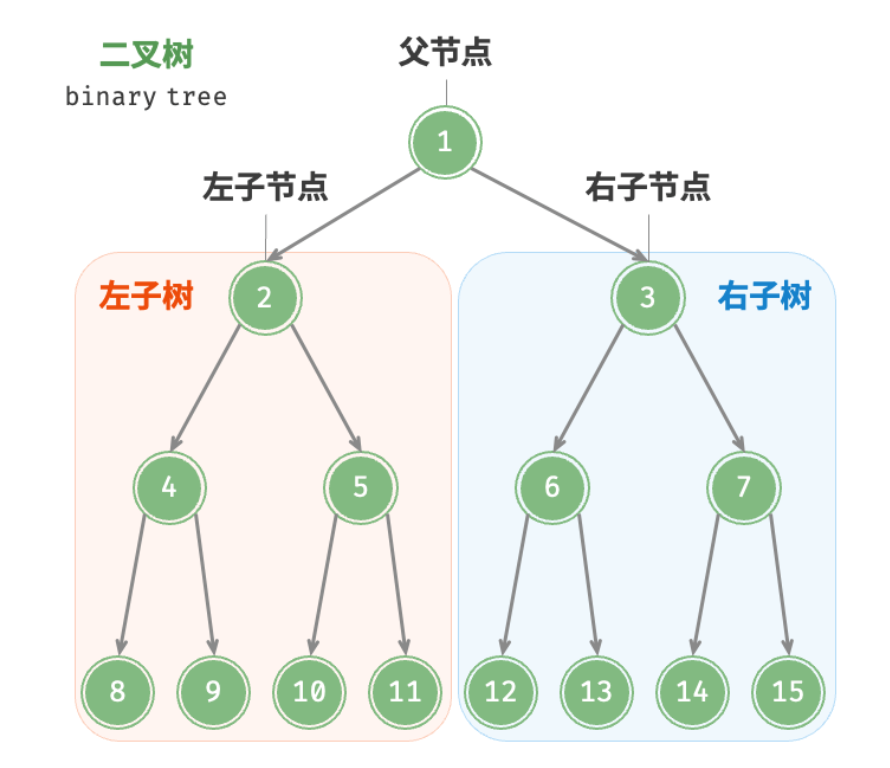

## 二叉树基本理论


### **二叉树的种类**

在我们解题过程中二叉树有两种主要的形式：满二叉树和完全二叉树。

#### **满二叉树**

满二叉树：如果一棵二叉树只有度为0的结点和度为2的结点，并且度为0的结点在同一层上，则这棵二叉树为满二叉树。

如图所示：


这棵二叉树为满二叉树，也可以说深度为k，有2^k-1个节点的二叉树。

#### **完全二叉树**

什么是完全二叉树？

完全二叉树的定义如下：在完全二叉树中，除了最底层节点可能没填满外，其余每层节点数都达到最大值，并且最下面一层的节点都集中在该层最左边的若干位置。若最底层为第 h 层（h从1开始），则该层包含 1~ 2^(h-1) 个节点。


**之前我们刚刚讲过优先级队列其实是一个堆，堆就是一棵完全二叉树，同时保证父子节点的顺序关系。**

  

#### **二叉搜索树（BST）**

前面介绍的树，都没有数值的，而二叉搜索树是有数值的了，**二叉搜索树是一个有序树**。

- 若它的左子树不空，则左子树上所有结点的值均小于它的根结点的值；
    
- 若它的右子树不空，则右子树上所有结点的值均大于它的根结点的值；
    
- 它的左、右子树也分别为二叉排序树
    

下面这两棵树都是搜索树


#### **平衡二叉搜索树（AVL）**

平衡二叉搜索树：又被称为AVL（Adelson-Velsky and Landis）树，且具有以下性质：它是一棵空树或它的左右两个子树的高度差的绝对值不超过1，并且左右两个子树都是一棵平衡二叉树。

如图：


最后一棵 不是平衡二叉树，因为它的左右两个子树的高度差的绝对值超过了1。

**C++中map、set、multimap，multiset的底层实现都是平衡二叉搜索树**，所以map、set的增删操作时间时间复杂度是logn，注意我这里没有说unordered_map、unordered_set，unordered_map、unordered_set底层实现是哈希表。

### **二叉树的存储方式**

**二叉树可以链式存储，也可以顺序存储。**

那么链式存储方式就用指针， 顺序存储的方式就是用数组。

顾名思义就是顺序存储的元素在内存是连续分布的，而链式存储则是通过指针把分布在各个地址的节点串联一起。

链式存储如图：


链式存储是大家很熟悉的一种方式，那么我们来看看如何顺序存储呢？

其实就是用数组来存储二叉树，顺序存储的方式如图：


用数组来存储二叉树如何遍历的呢？

**如果父节点的数组下标是 i，那么它的左孩子就是 i * 2 + 1，右孩子就是 i * 2 + 2。**

但是用链式表示的二叉树，更有利于我们理解，所以一般我们都是用链式存储二叉树。

**但数组依然可以表示二叉树。**

### **二叉树的遍历方式**

关于二叉树的遍历方式，要知道二叉树遍历的基本方式都有哪些。

二叉树主要有两种遍历方式：

1. 深度优先遍历：先往深走，遇到叶子节点再往回走。
    
2. 广度优先遍历：一层一层的去遍历。
    

**这两种遍历是图论中最基本的两种遍历方式**，后面在介绍图论的时候 还会介绍到。

那么从深度优先遍历和广度优先遍历进一步拓展，才有如下遍历方式：

- 深度优先遍历
    
    - 前序遍历（递归法，迭代法）
        
    - 中序遍历（递归法，迭代法）
        
    - 后序遍历（递归法，迭代法）
        
- 广度优先遍历
    
    - 层次遍历（迭代法）
        

**这里前中后，其实指的就是中间节点的遍历顺序**，只要大家记住 前中后序指的就是中间节点的位置就可以了。

看如下中间节点的顺序，就可以发现，中间节点的顺序就是所谓的遍历方式

- 前序遍历：中左右
    
- 中序遍历：左中右
    
- 后序遍历：左右中
    

大家可以对着如下图，看看自己理解的前后中序有没有问题。


经常会使用递归的方式来实现深度优先遍历，也就是实现前中后序遍历，使用递归是比较方便的。

**之前我们讲栈与队列的时候，就说过栈其实就是递归的一种实现结构**，也就说前中后序遍历的逻辑其实都是可以借助栈使用递归的方式来实现的。

而广度优先遍历的实现一般使用队列来实现，这也是队列先进先出的特点所决定的，因为需要先进先出的结构，才能一层一层的来遍历二叉树。

**这里其实我们又了解了栈与队列的一个应用场景了。**

### **二叉树的定义**

刚刚我们说过了二叉树有两种存储方式顺序存储，和链式存储，顺序存储就是用数组来存，这个定义没啥可说的，我们来看看链式存储的二叉树节点的定义方式。

C++代码如下：

```C++
struct TreeNode {
    int val;
    TreeNode *left;
    TreeNode *right;
    TreeNode(int x) : val(x), left(NULL), right(NULL) {}
};
```

大家会发现二叉树的定义 和链表是差不多的，相对于链表 ，二叉树的节点里多了一个指针， 有两个指针，指向左右孩子。

这里要提醒大家要注意二叉树节点定义的书写方式。

### **总结**

二叉树是一种基础数据结构，在算法面试中都是常客，也是众多数据结构的基石。

**说到二叉树，就不得不说递归。**

  

## 二叉树遍历实践

### 递归遍历

**每次写递归，都按照这三要素来写，可以保证大家写出正确的递归算法！**

1. **确定递归函数的参数和返回值：** 确定哪些参数是递归的过程中需要处理的，那么就在递归函数里加上这个参数， 并且还要明确每次递归的返回值是什么进而确定递归函数的返回类型。
    
2. **确定终止条件：** 写完了递归算法, 运行的时候，经常会遇到栈溢出的错误，就是没写终止条件或者终止条件写的不对，操作系统也是用一个栈的结构来保存每一层递归的信息，如果递归没有终止，操作系统的内存栈必然就会溢出。
    
3. **确定单层递归的逻辑：** 确定每一层递归需要处理的信息。在这里也就会重复调用自己来实现递归的过程。
    

**以下以前序遍历为例：**

1. **确定递归函数的参数和返回值**：因为要打印出前序遍历节点的数值，所以参数里需要传入vector来放节点的数值，除了这一点就不需要再处理什么数据了也不需要有返回值，所以递归函数返回类型就是void，代码如下：
    

`void traversal(TreeNode* cur, vector<int>& vec)`

1. **确定终止条件**：在递归的过程中，如何算是递归结束了呢，当然是当前遍历的节点是空了，那么本层递归就要结束了，所以如果当前遍历的这个节点是空，就直接return，代码如下：
    

`if (cur == NULL) return;`

1. **确定单层递归的逻辑**：前序遍历是中左右的循序，所以在单层递归的逻辑，是要先取中节点的数值，代码如下：
    

```C++
vec.push_back(cur->val);    // 中
traversal(cur->left, vec);  // 左
traversal(cur->right, vec); // 右
```

单层递归的逻辑就是按照中左右的顺序来处理的，这样二叉树的前序遍历，基本就写完了，再看一下完整代码：

前序遍历：

```C++
class Solution {
public:void traversal(TreeNode* cur, vector<int>& vec) {
        if (cur == NULL) return;
        vec.push_back(cur->val);    // 中traversal(cur->left, vec);  // 左traversal(cur->right, vec); // 右
    }
    vector<int> preorderTraversal(TreeNode* root) {
        vector<int> result;
        traversal(root, result);
        return result;
    }
};
```

  

**递归的实现就是：每一次递归调用都会把函数的局部变量、参数值和返回地址等压入调用栈中**，然后递归返回的时候，从栈顶弹出上一次递归的各项参数，所以这就是递归为什么可以返回上一层位置的原因。

### 迭代遍历

此时大家应该知道我们用栈也可以是实现二叉树的前后中序遍历了。

**递归能做的，栈也能做（递归实质就是利用调用栈），所以可以用栈迭代。**

我们先看一下前序遍历。

前序遍历是中左右，每次先处理的是中间节点，那么先将根节点放入栈中，然后将右孩子加入栈，再加入左孩子。

为什么要先加入 右孩子，再加入左孩子呢？ 因为这样出栈的时候才是中左右的顺序。

```C++
class Solution {
public:
    vector<int> preorderTraversal(TreeNode* root) {
        stack<TreeNode*> st;
        vector<int> result;
        if (root == NULL) return result;
        st.push(root);
        while (!st.empty()) {
            TreeNode* node = st.top();                       // 中
            st.pop();
            result.push_back(node->val);
            if (node->right) st.push(node->right);           // 右（空节点不入栈）
            if (node->left) st.push(node->left);             // 左（空节点不入栈）
        }
        return result;
    }
};
```

此时会发现貌似使用迭代法写出前序遍历并不难，确实不难。

**再用迭代法写中序遍历的时候，会发现套路又不一样了，目前的前序遍历的逻辑无法直接应用到中序遍历上。**

**中序遍历，可以写出如下代码：**

```C++
class Solution {
public:
    vector<int> inorderTraversal(TreeNode* root) {
        vector<int> result;
        stack<TreeNode*> st;
        TreeNode* cur = root;
        while (cur != NULL || !st.empty()) {
            if (cur != NULL) { // 指针来访问节点，访问到最底层
                st.push(cur); // 将访问的节点放进栈
                cur = cur->left;                // 左
            } else {
                cur = st.top(); // 从栈里弹出的数据，就是要处理的数据（放进result数组里的数据）
                st.pop();
                result.push_back(cur->val);     // 中
                cur = cur->right;               // 右
            }
        }
        return result;
    }
};
```

**所以后序遍历只需要前序遍历的代码稍作修改就可以了，代码如下：**

```C++
class Solution {
public:
    vector<int> postorderTraversal(TreeNode* root) {
        stack<TreeNode*> st;
        vector<int> result;
        if (root == NULL) return result;
        st.push(root);
        while (!st.empty()) {
            TreeNode* node = st.top();
            st.pop();
            result.push_back(node->val);
            if (node->left) st.push(node->left); // 相对于前序遍历，这更改一下入栈顺序 （空节点不入栈）
            if (node->right) st.push(node->right); // 空节点不入栈
        }
        reverse(result.begin(), result.end()); // 将结果反转之后就是左右中的顺序了return result;
    }
};
```

此时我们用迭代法写出了二叉树的前后中序遍历，大家可以看出前序和中序是完全两种代码风格，并不像递归写法那样代码稍做调整，就可以实现前后中序。

**这是因为前序遍历中访问节点（遍历节点）和处理节点（将元素放进result数组中）可以同步处理，但是中序就无法做到同步！**

  

其实**针对三种遍历方式，使用迭代法是可以写出统一风格的代码！**

**重头戏来了，接下来介绍一下统一写法。**

**那我们就将访问的节点放入栈中，把要处理的节点也放入栈中但是要做标记。**

如何标记呢，**就是要处理的节点放入栈之后，紧接着放入一个空指针作为标记。** 这种方法也可以叫做标记法。

**中序遍历：**

```C++
class Solution {
public:
    vector<int> inorderTraversal(TreeNode* root) {
        vector<int> result;
        stack<TreeNode*> st;
        if (root != NULL) st.push(root);
        while (!st.empty()) {
            TreeNode* node = st.top();
            if (node != NULL) {
                st.pop(); // 将该节点弹出，避免重复操作，下面再将右中左节点添加到栈中if (node->right) st.push(node->right);  // 添加右节点（空节点不入栈）

                st.push(node);                          // 添加中节点
                st.push(NULL); // 中节点访问过，但是还没有处理，加入空节点做为标记。if (node->left) st.push(node->left);    // 添加左节点（空节点不入栈）
            } else { // 只有遇到空节点的时候，才将下一个节点放进结果集
                st.pop();           // 将空节点弹出
                node = st.top();    // 重新取出栈中元素
                st.pop();
                result.push_back(node->val); // 加入到结果集
            }
        }
        return result;
    }
};
```

可以看出我们将访问的节点直接加入到栈中，但如果是处理的节点则后面放入一个空节点， 这样只有空节点弹出的时候，才将下一个节点放进结果集。

此时我们再来看前序遍历代码。

```C++
class Solution {
public:
    vector<int> preorderTraversal(TreeNode* root) {
        vector<int> result;
        stack<TreeNode*> st;
        if (root != NULL) st.push(root);
        while (!st.empty()) {
            TreeNode* node = st.top();
            if (node != NULL) {
                st.pop();
                if (node->right) st.push(node->right);  // 右
                if (node->left) st.push(node->left);    // 左
                st.push(node);                          // 中
                st.push(NULL);
            } else {
                st.pop();
                node = st.top();
                st.pop();
                result.push_back(node->val);
            }
        }
        return result;
    }
};
```

后序

```C++
class Solution {
public:
    vector<int> postorderTraversal(TreeNode* root) {
        vector<int> result;
        stack<TreeNode*> st;
        if (root != NULL) st.push(root);
        while (!st.empty()) {
            TreeNode* node = st.top();
            if (node != NULL) {
                st.pop();
                st.push(node);                          // 中
                st.push(NULL);

                if (node->right) st.push(node->right);  // 右
                if (node->left) st.push(node->left);    // 左

            } else {
                st.pop();
                node = st.top();
                st.pop();
                result.push_back(node->val);
            }
        }
        return result;
    }
};
```

  

### 层序遍历

需要借用一个辅助数据结构即队列来实现，**队列先进先出，符合一层一层遍历的逻辑，而用栈先进后出适合模拟深度优先遍历也就是递归的逻辑。而这种层序遍历方式就是图论中的广度优先遍历，只不过我们应用在二叉树上。**

```C++
class Solution {
public:
    vector<vector<int>> levelOrder(TreeNode* root) {
        queue<TreeNode*> que;
        if (root != NULL) que.push(root);
        vector<vector<int>> result;
        while (!que.empty()) {
            int size = que.size();
            vector<int> vec;
            // 这里一定要使用固定大小size，不要使用que.size()，因为que.size是不断变化的
            for (int i = 0; i < size; i++) {
                TreeNode* node = que.front();
                que.pop();
                vec.push_back(node->val);
                if (node->left) que.push(node->left);
                if (node->right) que.push(node->right);
            }
            result.push_back(vec);
        }
        return result;
    }
};

# 递归法
class Solution {
public:void order(TreeNode* cur, vector<vector<int>>& result, int depth)
    {
        if (cur == nullptr) return;
        if (result.size() == depth) result.push_back(vector<int>());
        result[depth].push_back(cur->val);
        order(cur->left, result, depth + 1);
        order(cur->right, result, depth + 1);
    }
    vector<vector<int>> levelOrder(TreeNode* root) {
        vector<vector<int>> result;
        int depth = 0;
        order(root, result, depth);
        return result;
    }
};
```
## 二叉搜索树
bst二叉搜索树中序遍历即可得到递增输出！！！一直想到中序遍历！利用有序性能更快更好地解决问题