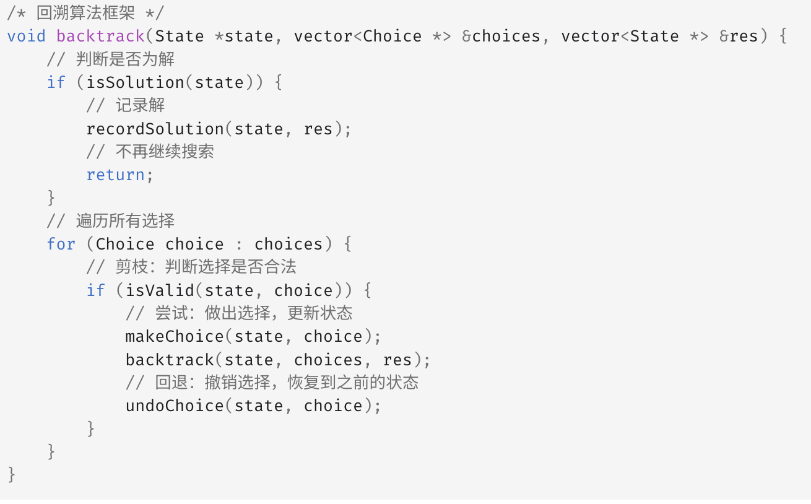

## 理论基础


### **什么是回溯法**

回溯法也可以叫做回溯搜索法，它是一种搜索的方式。

回溯是递归的副产品，只要有递归就会有回溯。

**所以以下讲解中，回溯函数也就是递归函数，指的都是一个函数**。

### **回溯法的效率**

回溯法的性能如何呢，这里要和大家说清楚了，**虽然回溯法很难，很不好理解，但是回溯法并不是什么高效的算法**。

**因为回溯的本质是穷举，穷举所有可能，然后选出我们想要的答案**，如果想让回溯法高效一些，可以加一些剪枝的操作，但也改不了回溯法就是穷举的本质。

一些问题能暴力搜出来就不错了，撑死了再剪枝一下，还没有更高效的解法。

### **回溯法解决的问题**

回溯法，一般可以解决如下几种问题：

- 组合问题：N个数里面按一定规则找出k个数的集合
    
- 切割问题：一个字符串按一定规则有几种切割方式
    
- 子集问题：一个N个数的集合里有多少符合条件的子集
    
- 排列问题：N个数按一定规则全排列，有几种排列方式
    
- 棋盘问题：N皇后，解数独等等
    

**相信大家看着这些之后会发现，每个问题，都不简单！**

另外，会有一些同学可能分不清什么是组合，什么是排列？

**组合是不强调元素顺序的，排列是强调元素顺序**。

例如：{1, 2} 和 {2, 1} 在组合上，就是一个集合，因为不强调顺序，而要是排列的话，{1, 2} 和 {2, 1} 就是两个集合了。

记住组合无序，排列有序，就可以了。

### **如何理解回溯法**

**回溯法解决的问题都可以抽象为树形结构。**

因为回溯法解决的都是在集合中递归查找子集，**集合的大小就构成了树的宽度，递归的深度就构成了树的深度**。

递归就要有终止条件，所以必然是一棵高度有限的树（N叉树）。

### **回溯法模板**

回溯三部曲。

- 回溯函数模板返回值以及参数
    

回溯算法中函数返回值一般为void。

回溯算法的参数可不像递归的时候那么容易一次性确定下来，所以一般先写逻辑，需要什么参数，就填什么参数。

```Plaintext
void backtracking(参数)
```

- 回溯函数终止条件
    

什么时候达到了终止条件，树中就可以看出，一般来说搜到叶子节点了（找到了最细分的一种情况），也就找到了满足条件的一条答案，把这个答案存放起来，并结束本层递归。

所以回溯函数终止条件伪代码如下：

```Plaintext
if (终止条件) {
    存放结果;
    return;
}
```

- 回溯搜索的遍历过程
    

在上面我们提到了，回溯法一般是在集合中递归搜索，集合的大小构成了树的宽度，递归的深度构成的树的深度。

如图：


注意图中，我特意举例集合大小和孩子的数量是相等的！

回溯函数遍历过程伪代码如下：

```Plaintext
for (选择：本层集合中元素（树中节点孩子的数量就是集合的大小）) {
    处理节点;
    backtracking(路径，选择列表); // 递归
    回溯，撤销处理结果
}
```

for循环就是遍历集合区间，可以理解一个节点有多少个孩子，这个for循环就执行多少次。

backtracking这里自己调用自己，实现递归。

大家可以从图中看出**for循环可以理解是横向遍历，backtracking（递归）就是纵向遍历**，这样就把这棵树全遍历完了，一般来说，搜索叶子节点就是找的其中一个结果了。

分析完过程，回溯算法模板框架如下：

```Plaintext
void backtracking(参数) {
    if (终止条件) {
        存放结果;
        return;
    }
    for (选择：本层集合中元素（树中节点孩子的数量就是集合的大小）) {
        处理节点;
        backtracking(路径，选择列表); // 递归
        回溯，撤销处理结果
    }
}
```

### 组合问题

**回溯法的魅力，用递归控制for循环嵌套的数量！**

本题我把回溯问题抽象为树形结构，可以直观的看出其搜索的过程：**for循环横向遍历，递归纵向遍历，回溯不断调整结果集**。

**剪枝精髓是：for循环在寻找起点的时候要有一个范围，如果这个起点到集合终止之间的元素已经不够 题目要求的k个元素了，就没有必要搜索了**。

#### 40 组合总和II（考验去重）

给定一个候选人编号的集合 `candidates` 和一个目标数 `target` ，找出 `candidates` 中所有可以使数字和为 `target` 的组合。

`candidates` 中的每个数字在每个组合中只能使用 **一次** 。

**注意：**解集不能包含重复的组合。

```C
#include <algorithm>
#include <vector>

using namespace std;

// @lc code=start
class Solution {
public:
  vector<vector<int>> res;
  vector<int> path;
  vector<bool> used;
  int size;
  void dfs(vector<int> &candidates, int target, int index) {
    if (target == 0) {
      res.push_back(path);
      return;
    }
    if (target < 0) {
      return;
    }
    for (int i = index; i < size; i++) {
      //去重集合，同一树层的重复元素只取一个，这里是关键，递归到下层可以重复使用
      if (i > 0 && candidates[i] == candidates[i - 1] && used[i - 1] == true) {
        //防止多个重复元素，只取一个
        used[i] = true;
        continue;
      }
      //递归下层时不用设置used，因为下一树层可以重复使用不同位置的相同数字
      path.push_back(candidates[i]);
      //与题目39对比，只需要在这里改一下，i变成i+1，不允许重复，但另一方面，要求去除重复的组合
      dfs(candidates, target - candidates[i], i + 1);
      path.pop_back();
      //本层中的每次循环都要设置true，因为同一树层中不能重复使用相同数字，不然会有重复的组合
      used[i] = true;
    }
    //本层结束应该还原状态，将used[i]重新置为false
    fill(used.begin(), used.end(), false);
    return;
  }
  vector<vector<int>> combinationSum2(vector<int> &candidates, int target) {
    sort(candidates.begin(), candidates.end());
    size = candidates.size();
    // resize的使用，初始化为false
    used.resize(size, false);
    dfs(candidates, target, 0);
    return res;
  }
};
```