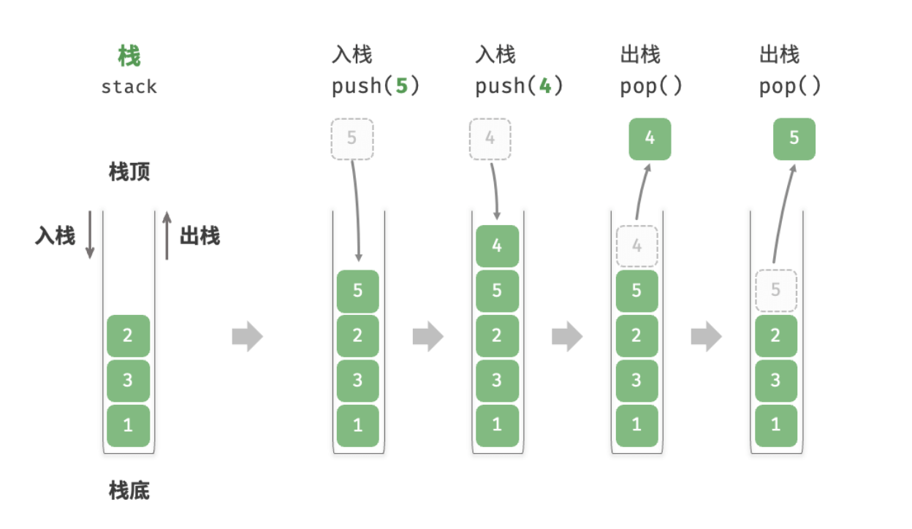

C++中的`std::stack`是一个容器适配器（container adapter），而不是容器（container）本身。它是建立在其他容器之上的一种封装，提供了一种LIFO（后进先出）的数据结构，其中元素的添加和移除只能在栈顶进行。

`std::stack`默认使用`std::deque`（双端队列）作为其底层容器，但也可以选择使用`std::vector`或`std::list`等其他容器作为底层实现。

我们也可以指定vector为栈的底层实现，初始化语句如下：

`std::stack<int,std::vector<int>> v_stack; //使用vector为底层容器的栈`

栈常见操作：push pop top empty

  

`std::queue`结构也类似，常见操作：push pop peek empty

双端队列 `std::deque`

  

`priority_queue<Type, Container, Functional>;`

Type是要存放的数据类型

Container是实现底层堆的容器，必须是数组实现的容器，如vector、deque

Functional是比较方式/比较函数/优先级

`priority_queue<Type>;`

此时默认的容器是vector，默认的比较方式是大顶堆`less<type>`

## 239滑动窗口最大值

给你一个整数数组 `nums`，有一个大小为 `k` 的滑动窗口从数组的最左侧移动到数组的最右侧。你只可以看到在滑动窗口内的 `k` 个数字。滑动窗口每次只向右移动一位。

返回 _滑动窗口中的最大值_ 。

eg:

```Plaintext
输入：nums = [1,3,-1,-3,5,3,6,7], k = 3
输出：[3,3,5,5,6,7]
```

【方法1：优先级队列】

一方面要排序，另一方面要记录元素位置，判断是否在窗口内。

排序队列，联想到优先级队列，标记元素位置，在队列中存放pair元素<nums[i],i>,标记位置。

移动窗口后，要插入新元素，还要循环判断队头元素的second是否在窗口内。

【方法2：双端队列】

显然，只要右面的某元素大于左侧，在之后的过程中，左侧不会成为窗口最大值，可以删去。

我们可以用队列存储还没被移除的数据下标，显然其对应的值是单调递减的。

推动窗口时，新元素进入队尾，不断弹出队尾的小值。（删去）

推动窗口时，检查队头是否出窗口，出则删去。

取最大值时，返回队头索引对应的值。

【方法3：分块和预处理】

以k为粒度对nums进行分组，并用两个数组记录每组内前i个与后i个数中最大值。

返回滑动窗口中最大值，即为前组后a个数最大值和后组前k-a个数最大值中较大者。

  

前面两种方法很多扣友说了，我来谈谈对第三种方法的理解，不得不说分块和预处理的方法真巧妙，题解说的前缀和后缀不太直观，我这里举个题目的例子来说明就好了，k=3。


preffix[i]存的是各个分组从分组开头到索引i的最大值（i % k == 0的值为各个分组的开头，这里对应是0,3,6），因为是从分组开头开始，所以是从左往右遍历，每次到分组的新的开头（进入新的分组），preffix[i]就直接更新为分组开头的元素，因为是从前往后遍历，所以是前缀最大值。看下面的例子：


suffix[i]存的是各个分组从分组末尾到索引i的最大值（ (i + 1） % k == 0或最后一个索引的值为各个分组的末尾，这里对应是2,5,7），因为是分组末尾开始，所以是从右往左遍历，每次到分组的新的末尾（进入新的分组），suffix[i]就直接更新组为分组末尾的元素。因为是从后往前遍历，所以是后缀最大值。看下面的例子：


一个窗口最常见的情况是元素分别落入两个分组：落入两个分组时，前一个分组我们使用suffixMax[i]获得索引为i的前缀最大值（范围是i到这个分组的末尾，从右往左，对应是后缀），后一个分组我们使用prefixMax[i+k-1]获得索引为i+k-1的后缀最大值（范围是这个分组的开头到i+k-1，从左往右，对应是前缀），这两个值再比较得到的最大值就是整个窗口的最大值。

而另一种窗口的情况是元素落在一个分组里，这时候对应的suffixMax[i]的i是分组的开头，prefixMax[i+k-1]的i+k-1是这个分组的末尾，它们相当从两个方向对分组遍历获得了最大值，所以它们的值是一样的，这两个值再比较得到的最大值也是整个窗口的最大值。

