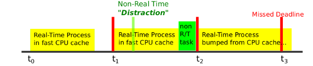
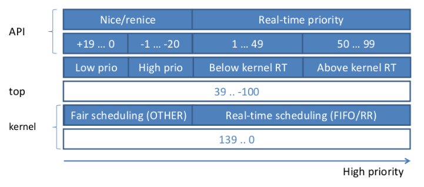
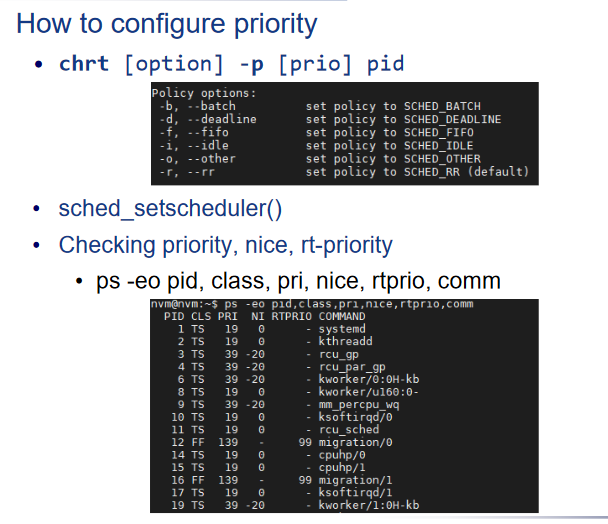
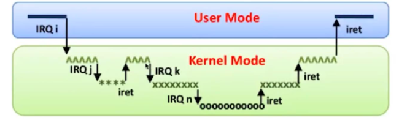
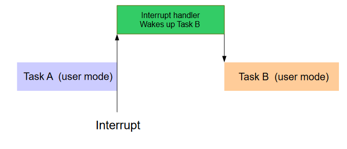
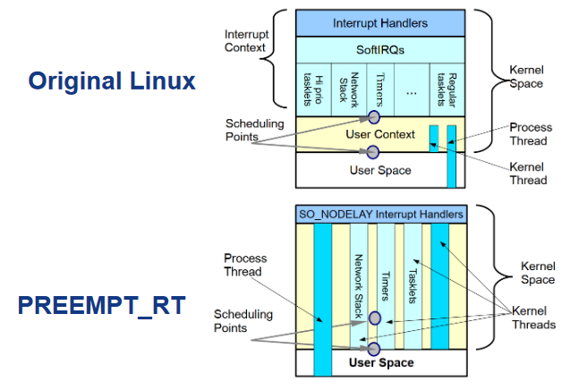
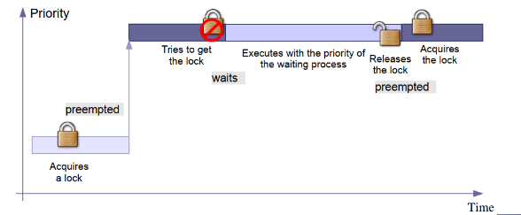
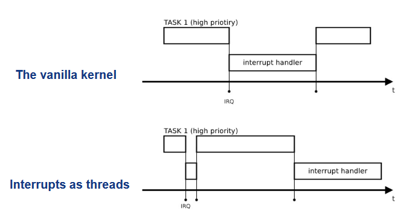

***本节为RT linux的设计，关键在于中断与调度两个步骤***
# Real-time Linux
> RTLinux:硬实时操作系统 (RTOS) 微内核，将整个 Linux 操作系统作为完全抢占式进程运行。

> Real-time linux(RT linux):a linux with
> - real-time feature
> - real-time extension(eg:RTLinux)

user process优先级最低，RT任务到来时将其抢占。

##### 中断
- timer interrupt：时钟检测，周期中断、
- software interrupt: 系统调用，主动释放资源
- hardware interrupt：硬件中断工作。

中断优先到达RTLinux,其可以先调度rt tasks，从而实现实时性。

1. 中断到达，rt kernel处理
2. 唤醒rt tasks
3. 实时调度器
4. 调度器时linux内核sleep，调度到某个任务（awake）
5. 调度器发现无rt task，回到内核

tips：通过管道传递中断。

# Linux
### linux not for RT
- linux调度目的为吞吐与公平
- system-call时不可抢占
- 吞吐相关优化
- cache可能不命中
  >

### linux 优先级
>Linux内核支持多种调度策略

进程有各种互相独立的优先级
- Nice value(-20 ~ 19)19最低
- Real-time priority （0~99）0最低

to config：

### 中断处理
- 上下文切换：存放在中断栈，系统栈，专用c寄存器。
- PIC（可编程中断处理器）：中断可以有优先级（so ：中断可以嵌套）
>

### 时钟中断的实现
- tick-based：tick以固定周期发起中断
- event-based：dispatcher事件触发设置下一个中断

### 延迟
内核延迟 = 中断延迟+中断处理+调度延迟+调度处理
延迟不可控！难以保证硬实时！
### 内核抢占（通过中断）
用户态可抢占：

linux内核态默认为非抢占式内核，中断后返回task A，直至A放弃cpu才开始执行B。实时系统的响应时间变长：
?阶段的时间越长，响应时间越长。

so：设计抢占式系统，并循环检查是否有更高优先级任务（总体执行时间变长，但高优先级任务响应时间变短）

# linux features for real-time
### 内核抢占模式可配置 CONFIG_PREEMPT
1. CONFIG_PREEMPT_NONE：默认，不可抢占（no forced preemption）
2. CONFIG_PREEMPT_VOLUNTARY：内核可以抢占内核
3. CONFIG_PREEMPT:绝大多数内核代码可被抢占。(PREEMPT_RT)
   >例外:持有自旋锁的内核临界区
   1.替换为可抢占结构
   2.尽可能支持抢占
   3.线程化中断请求
   4.自旋锁spinlock替换为mutex(sleeping spinlocks)
   

### 锁的优先级继承

### 线程化中断
interrupt抽象为线程，可以具有优先级/异步执行/被调度，高优先级任务无需等待整个中断处理完成

做最少的工作并唤醒相应的线程（task 1）。

